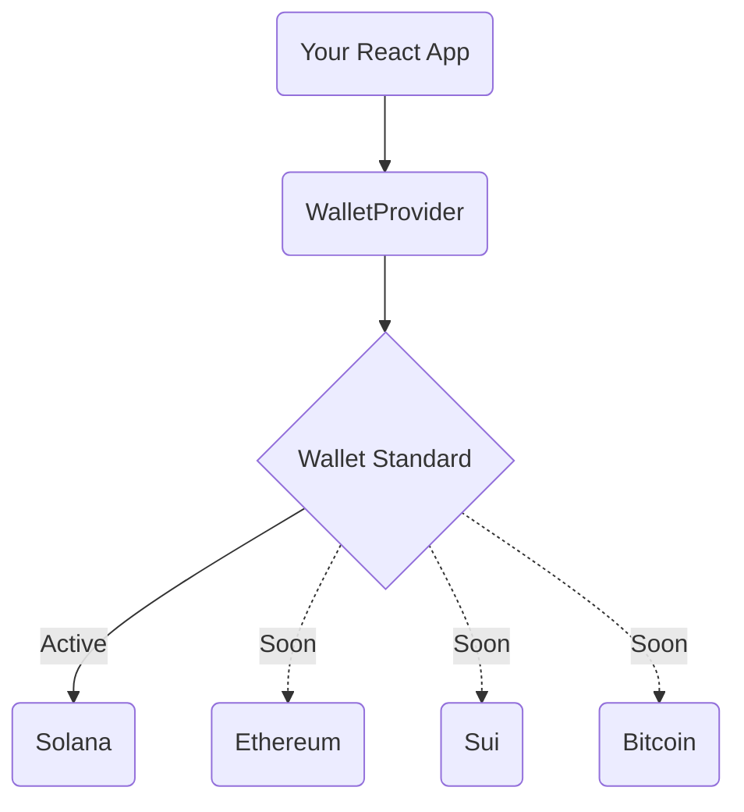

This guide provides the essentials for adding **wallet/kit** components to your React application.

## Architecture & Multi-chain Support

**wallet/kit** is built on top of the [Wallet Standard](https://wallet-standard.github.io/wallet-standard), a chain-agnostic standard for connecting wallets to dApps. This means the core logic is **not tied to a specific blockchain**.

While we currently provide first-class support for **Solana**, the architecture is designed to support **Ethereum, Sui, and Bitcoin** in the future with minimal changes to your UI.



The `WalletProvider` abstracts the complexity of connecting to different chains, exposing a unified API for accounts and networks.

## Prerequisites

Our components are built with [Tailwind CSS v4](https://tailwindcss.com). Before you begin, make sure you have a React project set up with Tailwind CSS.

If you haven't set up shadcn/ui yet, follow the [shadcn/ui installation guide](https://ui.shadcn.com/docs/installation) first.

## Adding Components

### Configure the Registry

First, add the `@wallet-kit` registry namespace to your `components.json` file. This is required for shadcn/ui to recognize wallet/kit components.

<Callout>
**Note**: If you're new to shadcn/ui registries, see the [shadcn/ui registry documentation](https://ui.shadcn.com/docs/registry) for more information.
</Callout>

```json title="components.json"
{
  "registries": {
    "@wallet-kit": "https://wallet-kit.ouestlabs.xyz/r/{name}.json"
  }
}
```

The `@wallet-kit` registry namespace allows you to install components using the `@wallet-kit/` prefix in shadcn CLI commands.

### Install Components

You can add components **automatically with the shadcn CLI** or **manually by copying the files**.

<CodeTabs>
  <TabsList>
    <TabsTrigger value="cli">CLI</TabsTrigger>
    <TabsTrigger value="manual">Manual</TabsTrigger>
  </TabsList>
  <TabsContent value="cli">
    Install components using the `@wallet-kit` registry namespace:

    ```bash
    npx shadcn@latest add @wallet-kit/provider @wallet-kit/connect
    ```
  </TabsContent>
  <TabsContent value="manual">
    <Steps>
      <Step>Install the runtime dependencies:</Step>

      ```bash
      npm install @wallet-standard/react @wallet-standard/core @nanostores/react nanostores lucide-react gill @gillsdk/react @tanstack/react-query
      ```

      <Callout>
      **Note**: `@tanstack/react-query` is required for Solana hooks, but `SolanaWalletProvider` handles all configuration automatically. Just wrap your app with `QueryClientProvider` - no additional setup needed.
      </Callout>

      <Step>Install the required shadcn/ui primitives:</Step>

      ```bash
      npx shadcn@latest add button dialog dropdown-menu alert avatar badge
      ```

      <Step>Install the wallet components from the `@wallet-kit` registry namespace:</Step>

      ```bash
      npx shadcn@latest add @wallet-kit/provider @wallet-kit/connect
      ```

      <Step>Copy and paste the code into your project and update imports.</Step>
    </Steps>
  </TabsContent>
</CodeTabs>

## Setup WalletProvider

The `WalletProvider` is the core component that manages wallet connections, network selection, and state persistence.

Wrap your app with `WalletProvider` at the root level and configure it using `createWalletConfig`.

### Basic Setup (Default)

The simplest setup - `SolanaWalletProvider` automatically uses the `QueryClient` from context. No additional configuration needed.

```tsx
// app/layout.tsx or _app.tsx
import { QueryClient, QueryClientProvider } from "@tanstack/react-query";
import {
  createWalletConfig,
  WalletProvider,
} from "@/components/wallet/provider";
import { createSolanaMainnet, createSolanaDevnet } from "@/lib/chains/solana";
import { SolanaWalletProvider } from "@/lib/chains/solana/adapter";

const queryClient = new QueryClient();

export default function RootLayout({ children }) {
  const config = createWalletConfig({
    networks: [createSolanaMainnet(), createSolanaDevnet()],
  });

  return (
    <html>
      <body>
        <QueryClientProvider client={queryClient}>
          <WalletProvider config={config}>
            <SolanaWalletProvider>
              {children}
            </SolanaWalletProvider>
          </WalletProvider>
        </QueryClientProvider>
      </body>
    </html>
  );
}
```

### Advanced Setup (Custom QueryClient)

For more control, you can pass a `QueryClient` instance explicitly with custom options.

```tsx
// app/layout.tsx or _app.tsx
import { QueryClient, QueryClientProvider } from "@tanstack/react-query";
import {
  createWalletConfig,
  WalletProvider,
} from "@/components/wallet/provider";
import { createSolanaMainnet, createSolanaDevnet } from "@/lib/chains/solana";
import { SolanaWalletProvider } from "@/lib/chains/solana/adapter";

const queryClient = new QueryClient({
  defaultOptions: {
    queries: {
      staleTime: 1000 * 60 * 5, // 5 minutes
      refetchOnWindowFocus: false,
    },
  },
});

export default function RootLayout({ children }) {
  const config = createWalletConfig({
    networks: [createSolanaMainnet(), createSolanaDevnet()],
  });

  return (
    <html>
      <body>
        <QueryClientProvider client={queryClient}>
          <WalletProvider config={config}>
            <SolanaWalletProvider queryClient={queryClient}>
              {children}
            </SolanaWalletProvider>
          </WalletProvider>
        </QueryClientProvider>
      </body>
    </html>
  );
}
```

### Use the component

```tsx
import { ConnectWallet } from "@/components/wallet/connect";

export function Header() {
  return (
    <header>
      <ConnectWallet />
    </header>
  );
}
```

## Styling

Components are styled with a design token system defined by CSS variables and implemented with Tailwind CSS. The variables follow the same approach as shadcn/ui and are fully customizable.

For detailed information about styling, color tokens, and customization options, see the [shadcn/ui theming documentation](https://ui.shadcn.com/docs/theming).

## Working with LLMs

We structure the documentation to make the components **AI-friendly**, so language models can understand, reason about, and modify them. To support this, we include:

- A [llms.txt](/llms.txt) file that provides a map of the documentation and component structure for your AI agent.
- A [llms-full.txt](/llms-full.txt) file containing an expanded view of the docs and component sources for deeper analysis.
- A **Copy Markdown** button on every page, so you can easily share content or feed it to your AI workflows.
