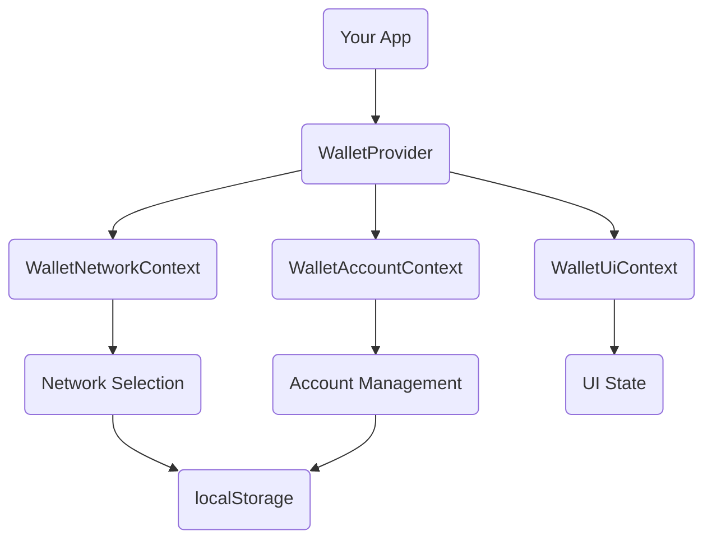

The `WalletProvider` is the **core component** that orchestrates all wallet interactions in your application. It must wrap your entire app (or the parts that need wallet functionality) to provide wallet state management, network selection, and account persistence.

## Why WalletProvider?

The `WalletProvider` serves as the foundation for all wallet-related functionality:

- **Multi-chain Support**: Manages multiple blockchain networks (Solana, Ethereum, Sui, etc.) through a unified API
- **State Management**: Tracks connected wallets, accounts, and network selection
- **Persistence**: Automatically saves and restores wallet connections across page reloads
- **Context Provision**: Exposes wallet state to all child components via React Context

## Installation

<CodeTabs>
  <TabsList>
    <TabsTrigger value="cli">CLI</TabsTrigger>
    <TabsTrigger value="manual">Manual</TabsTrigger>
  </TabsList>
  <TabsContent value="cli">
    ```bash
    npx shadcn@latest add @wallet-kit/provider
    ```
  </TabsContent>
  <TabsContent value="manual">
    <Steps>
      <Step>Install runtime dependencies:</Step>

      ```bash
      npm install @wallet-standard/react @nanostores/react nanostores @tanstack/react-query
      ```
      <Step>Install blockchain-specific dependencies (for Solana):</Step>

      ```bash
      npm install gill @gillsdk/react
      ```
      <Step>Copy the provider code:</Step>
      <Source name="provider" title="components/wallet/provider.tsx" />
      <Step>Copy the wallet hook:</Step>
      <Source name="use-wallet" title="hooks/use-wallet.ts" />
      <Step>Copy the chain utilities:</Step>
      <Source name="context" title="lib/chains/context.ts" />
      <Source name="network" title="lib/chains/network.ts" />
      <Source name="storage" title="lib/chains/storage.ts" />
      <Step>Copy blockchain integration (for Solana):</Step>
      <Source name="solana" title="lib/chains/solana/index.ts" />
    </Steps>

  </TabsContent>
</CodeTabs>

## Initialization

The `WalletProvider` must be initialized with a configuration object. Use `createWalletConfig` to create the configuration with your networks and settings.

### Basic Setup

```tsx
import {
  createWalletConfig,
  WalletProvider,
} from "@/components/wallet/provider";
import { createSolanaMainnet, createSolanaDevnet } from "@/lib/chains/solana";

export default function App({ children }) {
  const config = createWalletConfig({
    networks: [createSolanaMainnet(), createSolanaDevnet()],
  });

  return <WalletProvider config={config}>{children}</WalletProvider>;
}
```

### Advanced Setup with Plugin Architecture

```tsx
import { QueryClient, QueryClientProvider } from "@tanstack/react-query";
import {
  createWalletConfig,
  WalletProvider,
} from "@/components/wallet/provider";
import { createStorageAccount, createStorageNetwork } from "@/lib/chains/storage";
import { createSolanaMainnet, createSolanaDevnet, createSolanaTestnet } from "@/lib/chains/solana";
import { SolanaWalletProvider } from "@/lib/chains/solana/adapter";

const queryClient = new QueryClient();

// Custom storage keys (optional)
const accountStorage = createStorageAccount("my-app:account");
const networkStorage = createStorageNetwork("my-app:network");

export default function App({ children }) {
  const config = createWalletConfig({
    networks: [
      createSolanaMainnet(),
      createSolanaDevnet(),
      createSolanaTestnet(),
    ],
    accountStorage,
    networkStorage,
    onNetworkChange: (networkId) => {
      console.log("Network changed to:", networkId);
    },
  });

  return (
    <QueryClientProvider client={queryClient}>
      <WalletProvider config={config}>
        <SolanaWalletProvider queryClient={queryClient}>
          {children}
        </SolanaWalletProvider>
      </WalletProvider>
    </QueryClientProvider>
  );
}
```

## Architecture

The provider initializes three main contexts that work together:



### 1. WalletNetworkContext

Manages the list of available networks and the currently selected network. It persists the selection to `localStorage`.

**Responsibilities:**

- Network selection and switching
- Network persistence
- Network validation

### 2. WalletAccountContext

Manages the currently connected account. It automatically attempts to reconnect to the last used wallet and account on mount.

**Responsibilities:**

- Account connection/disconnection
- Account persistence
- Wallet-to-account mapping
- Account validation

### 3. WalletUiContext

Exposes UI helpers like `connect`, `disconnect`, and modal state management.

**Responsibilities:**

- UI state (modals, dialogs)
- Wallet list filtering
- Connection helpers

## API Reference

### WalletProvider

The main provider component that wraps your application.

#### Props

| Prop       | Type           | Default | Description                                                                 |
| ---------- | -------------- | ------- | --------------------------------------------------------------------------- |
| `children` | `ReactNode`    | -       | **Required.** The child components that will have access to wallet context. |
| `config`   | `WalletConfig` | -       | **Required.** Configuration object created with `createWalletConfig()`.     |

### createWalletConfig

Factory function to create a wallet configuration object.

```typescript
function createWalletConfig(props: WalletConfig): WalletConfig
```

### WalletConfig

Configuration object for `WalletProvider`.

| Prop               | Type                                 | Default                  | Description                                                                          |
| ------------------ | ------------------------------------ | ------------------------ | ------------------------------------------------------------------------------------ |
| `networks`         | `Network[]`                          | -                        | **Required.** Array of network configurations. Each network must have a unique `id`. |
| `defaultNetworkId` | `Network["id"]`                      | First network in array   | The network ID to use when no network is stored or selected.                         |
| `client`           | `unknown`                            | -                        | Optional blockchain client instance (e.g., Solana connection object).                |
| `accountStorage`   | `StorageAccount`                     | `createStorageAccount()` | Custom storage for account persistence.                                              |
| `networkStorage`   | `StorageNetwork`                     | `createStorageNetwork()` | Custom storage for network persistence.                                              |
| `onNetworkChange`  | `(networkId: Network["id"]) => void` | -                        | Callback fired when the network changes.                                             |

## Persistence

State is automatically persisted to `localStorage` using `nanostores`:

- **Network**: The ID of the selected network (e.g., `"solana:mainnet"`)
- **Account**: A string in the format `"walletName:accountAddress"` (e.g., `"Phantom:7xKXtg2CW87d97TXJSDpbD5jBkheTqA83TZRuJosgAsU"`)

This ensures that users stay connected and on the correct network across page reloads.

## Multi-chain Support

The `WalletProvider` is designed to work with multiple blockchains using a plugin architecture. While we currently provide first-class support for Solana, you can add support for other chains by:

1. Creating network definitions using `defineNetwork()`
2. Implementing chain-specific utilities (like `formatSol` for Solana)
3. Creating chain-specific adapter providers (like `SolanaWalletProvider`)
4. Passing the networks to the provider and wrapping with chain adapters

### Plugin Architecture

The wallet kit uses a plugin-based architecture where each blockchain can provide an optional adapter:

```tsx
<WalletProvider config={walletConfig}>
  <SolanaWalletProvider>
    {/* Future: <BitcoinWalletProvider> */}
    {/* Future: <EthereumWalletProvider> */}
    {children}
  </SolanaWalletProvider>
</WalletProvider>
```

This allows consumers to choose which blockchains to enable. See the [Supported Networks](/docs/networks) section for blockchain-specific integrations.

<Callout>
- The provider must be placed at a high level in your component tree (typically in your root layout or `_app.tsx`)
- All wallet components (`ConnectWallet`, `WalletMenu`, etc.) must be children of `WalletProvider`
- Network IDs must follow the format `"chain:network"` (e.g., `"solana:mainnet"`)
- The provider automatically filters wallets based on the active network's chain namespace
</Callout>
