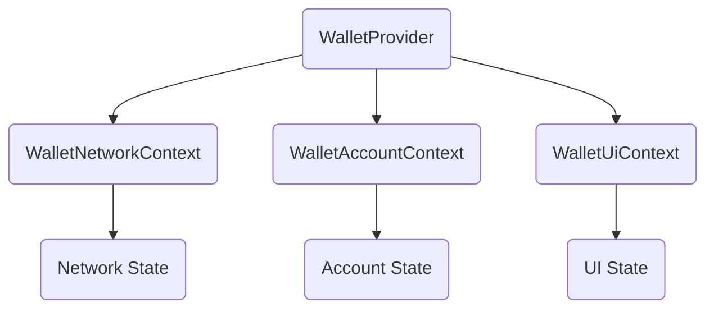

The `context.ts` file defines the React Context types and providers used throughout the wallet kit for managing wallet state.

## Overview

This module exports three main contexts:

1. **WalletNetworkContext**: Manages network selection and available networks
2. **WalletAccountContext**: Manages connected wallet accounts
3. **WalletUiContext**: Manages UI state and wallet interactions

## Installation

<CodeTabs>
  <TabsList>
    <TabsTrigger value="cli">CLI</TabsTrigger>
    <TabsTrigger value="manual">Manual</TabsTrigger>
  </TabsList>
  <TabsContent value="cli">
    ```bash
    npx shadcn@latest add @wallet-kit/context
    ```
  </TabsContent>
  <TabsContent value="manual">
    <Steps>
      <Step>Copy the context code:</Step>
      <Source name="context" title="lib/chains/context.ts" />
    </Steps>
  </TabsContent>
</CodeTabs>

## Architecture

The three contexts work together to provide complete wallet state management:



## API Reference

### WalletNetworkContext

Context for managing network state.

#### Value Type

```typescript
type WalletNetworkContextValue = {
  network: Network;
  networks: Network[];
  setNetwork(networkId: Network["id"]): void;
}
```

- `network`: The currently active network
- `networks`: Array of all available networks
- `setNetwork`: Function to change the active network

### WalletAccountContext

Context for managing account state.

#### Value Type

```typescript
type WalletAccountState = {
  account: UiWalletAccount | undefined;
  accountKeys: string[];
  network: Network;
  setAccount: React.Dispatch<React.SetStateAction<UiWalletAccount | undefined>>;
  wallet: UiWallet | undefined;
}
```

- `account`: The currently connected account (or `undefined`)
- `accountKeys`: Array of keys used for caching/storage
- `network`: The active network
- `setAccount`: Function to set/update the connected account
- `wallet`: The wallet that owns the connected account

### WalletUiContext

Context for managing UI state and interactions.

#### Value Type

```typescript
type WalletUiContextValue<TClient = unknown> = {
  account?: UiWalletAccount;
  accountKeys: string[];
  client?: TClient;
  connect: (wallet: UiWalletAccount) => void;
  connected: boolean;
  copy: () => void;
  disconnect: () => void;
  isModalOpen: boolean;
  setIsModalOpen: (open: boolean) => void;
  wallet?: UiWallet;
  wallets: UiWallet[];
}
```

- `account`: The connected account
- `accountKeys`: Storage keys for the account
- `client`: Optional blockchain client instance
- `connect`: Function to connect a wallet account
- `connected`: Boolean indicating if a wallet is connected
- `copy`: Function to copy the account address
- `disconnect`: Function to disconnect the wallet
- `isModalOpen`: State for wallet connection modal
- `setIsModalOpen`: Function to control modal visibility
- `wallet`: The connected wallet
- `wallets`: Array of available wallets

## Usage

These contexts are typically accessed through hooks:

```tsx
import { useWalletNetwork } from "@/hooks/use-wallet"
import { useWalletAccount } from "@/hooks/use-wallet"
import { useWallet } from "@/hooks/use-wallet"

export default function MyComponent() {
  const { network, setNetwork } = useWalletNetwork()
  const { account, wallet } = useWalletAccount()
  const { connect, disconnect, connected } = useWallet()
  
  // Use the context values...
}
```

<Callout>
- These contexts are provided by `WalletProvider` - you don't need to create them manually
- All contexts are typed with TypeScript for type safety
- The contexts work together to provide a complete wallet state management solution
</Callout>
