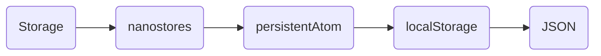

The `storage.ts` file provides utilities for creating persistent storage atoms using [`nanostores`](https://github.com/nanostores/nanostores) that automatically sync with `localStorage`.

## Overview

This module provides:

- `Storage` class: A wrapper around `nanostores` persistent atoms
- `createStorage()`: Factory function to create storage instances
- `createStorageAccount()`: Pre-configured storage for wallet accounts
- `createStorageNetwork()`: Pre-configured storage for network IDs

## Installation

<CodeTabs>
  <TabsList>
    <TabsTrigger value="cli">CLI</TabsTrigger>
    <TabsTrigger value="manual">Manual</TabsTrigger>
  </TabsList>
  <TabsContent value="cli">
    ```bash
    npx shadcn@latest add @wallet-kit/storage
    ```
  </TabsContent>
  <TabsContent value="manual">
    <Steps>
      <Step>Install dependencies:</Step>
      ```bash
      npm install @nanostores/persistent nanostores
      ```
      <Step>Copy the storage code:</Step>
      <Source name="storage" title="lib/chains/storage.ts" />
    </Steps>
  </TabsContent>
</CodeTabs>

## Architecture

Storage uses `nanostores` persistent atoms to automatically sync with `localStorage`:



## API Reference

### Storage Class

A generic storage class that wraps `nanostores` persistent atoms.

```typescript
class Storage<T> {
  get(): T | undefined
  set(value: T | undefined): void
  get value(): ReadableAtom<T | undefined>
  readonly key: string
  readonly initial: T | undefined
}
```

#### Methods

| Method | Description |
| --- | --- |
| `get()` | Gets the current stored value |
| `set(value)` | Sets a new value (persists to localStorage) |
| `value` | Returns a reactive atom that can be subscribed to |

#### Properties

| Property | Type | Description |
| --- | --- | --- |
| `key` | `string` | The localStorage key |
| `initial` | `T \| undefined` | The initial/default value |

### createStorage

Factory function to create a storage instance.

```typescript
function createStorage<T>(key: string, defaultValue?: T): Storage<T>
```

#### Parameters

| Parameter | Type | Description |
| --- | --- | --- |
| `key` | `string` | The localStorage key |
| `defaultValue` | `T` (optional) | The initial value |

### createStorageAccount

Creates a storage instance for wallet accounts.

```typescript
function createStorageAccount(key = "wallet-kit:account"): StorageAccount
```

Stores account data as: `"walletName:accountAddress"`

### createStorageNetwork

Creates a storage instance for network IDs.

```typescript
function createStorageNetwork(key = "wallet-kit:network"): StorageNetwork
```

Stores network data as: `"chain:network"` (e.g., `"solana:mainnet"`)

## Usage

### Basic Storage

```tsx
import { createStorage } from "@/lib/chains/storage"

const userStorage = createStorage<string>("my-app:user", "default-user")

// Get value
const user = userStorage.get()

// Set value (automatically persists to localStorage)
userStorage.set("new-user")

// Subscribe to changes
import { useStore } from "@nanostores/react"

function MyComponent() {
  const user = useStore(userStorage.value)
  // Component re-renders when user changes
}
```

### Account Storage

```tsx
import { createStorageAccount } from "@/lib/chains/storage"

const accountStorage = createStorageAccount("my-app:account")

// Store account
accountStorage.set("Phantom:7xKXtg2CW87d97TXJSDpbD5jBkheTqA83TZRuJosgAsU")

// Get account
const account = accountStorage.get()
```

### Network Storage

```tsx
import { createStorageNetwork } from "@/lib/chains/storage"

const networkStorage = createStorageNetwork("my-app:network")

// Store network
networkStorage.set("solana:mainnet")

// Get network
const network = networkStorage.get()
```

### Custom Storage Keys

```tsx
import { createStorageAccount, createStorageNetwork } from "@/lib/chains/storage"

// Use custom keys to avoid conflicts
const accountStorage = createStorageAccount("my-app:wallet-account")
const networkStorage = createStorageNetwork("my-app:wallet-network")
```

## Persistence

- Values are automatically serialized to JSON and stored in `localStorage`
- Values are automatically deserialized when retrieved
- Changes are reactive - components using `useStore()` will re-render when values change
- Storage persists across page reloads and browser sessions

<Callout>
- Storage uses `@nanostores/persistent` under the hood
- Values are JSON-serialized, so complex objects are supported
- The storage key should be unique to avoid conflicts with other apps
- Default values are used when no stored value exists
</Callout>
